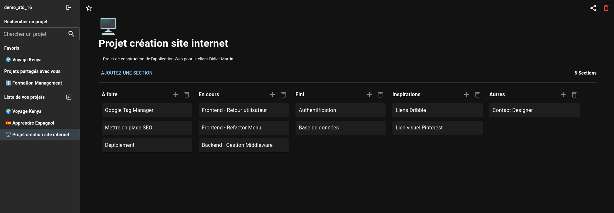

# Test ATD16 - Application Full Stack de Gestion de Projet - 

Dans le cadre du test technique demandé par M. CLERCQ, voici le résultat :

## Liens des bibliothèques du projet

Pour ce projet, j'ai utilisé : 

- Create react app:https://create-react-app.dev/
- Redux Toolkit: https://redux-toolkit.js.org/
- React beautiful dnd: https://github.com/atlassian/react-beautiful-dnd/
- Material-UI: https://mui.com/
- EmojiMart: https://github.com/missive/emoji-mart
- Express: https://expressjs.com/
- Mangoose: https://mongoosejs.com/

## Lien des informations du projet

[Lien Page Notion](https://maximenoel.notion.site/maximenoel/Test-ATD16-f53d9f2380b549229d2fd24a49d3a3e3)

## Lancement du projet

Pour tester le projet en local, il vous faudra NodeJS (version >16) installé sur votre machine.

1. Télécharger le projet Github avec la commande
`git clone git@github.com:MachinaDev/atd-16-test-technique.git`

2. A la racine du dossier `atd-16-test-technique/server`, copier le fichier `.env.example` pour créer un fichier `.env` et remplissez les champs de variables d'environnement

- PORT=5000
- MONGODB_URL=AdresseDeVotreBaseDeDonnées
- TOKEN_SECRET_KEY=NimporteQuelleChaîneDeCaractèresFeraLAffaire
- PASSWORD_SECRET_KEY=NimporteQuelleChaîneDeCaractèresFeraLAffaire

1. Ouvrez maintenant deux terminaux :

- Dans le premier terminal, rendez-vous à la racine du dossier `client` puis tapez la commande suivante:
`yarn install && yarn start`

- Dans le second terminal, rendez-vous à la racine du dossier `server` puis tapez la commande suivante:
`yarn install && yarn start`

### Enjoy ! 